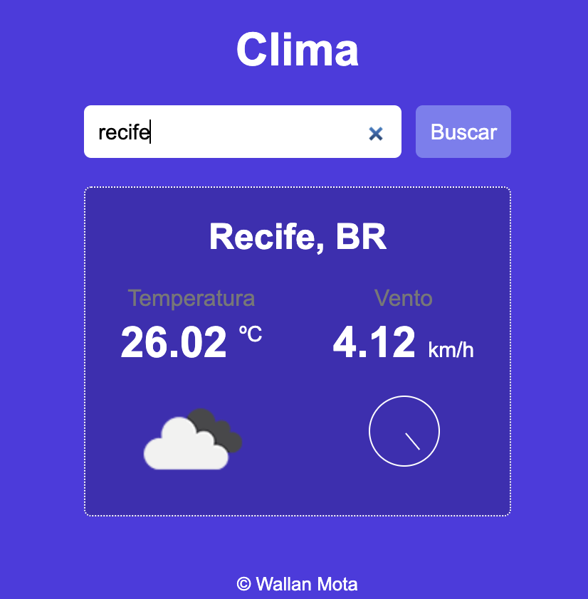

# Clima-Tempo

App de clima criado com HTML, CSS e JS.

[**Clique aqui**](https://wallanmota.github.io/Clima-Tempo/) para ver projeto funcionando ;)

Nesse projeto foi utilizado a API [Open Weather](https://openweathermap.org/api) para buscar os dados do clima da cidade digitada.

